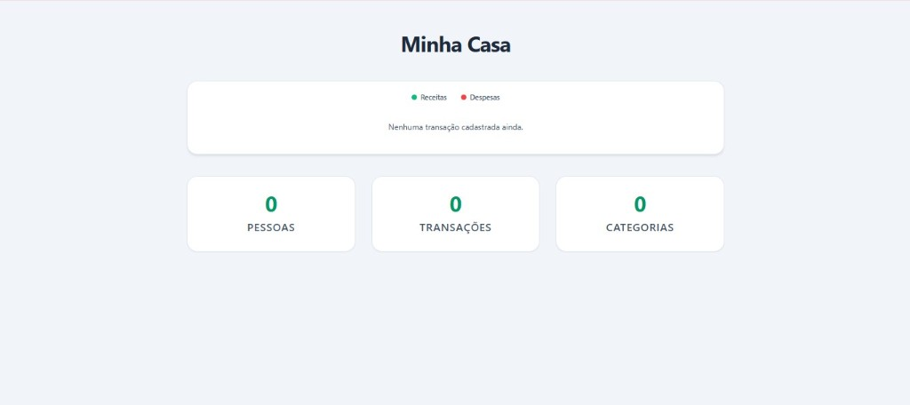
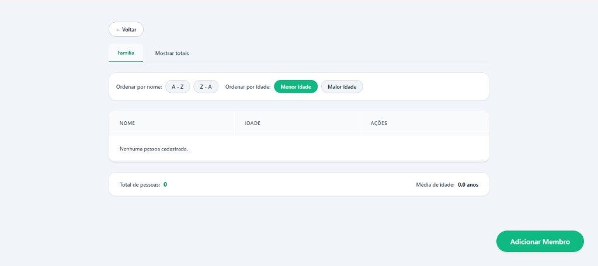
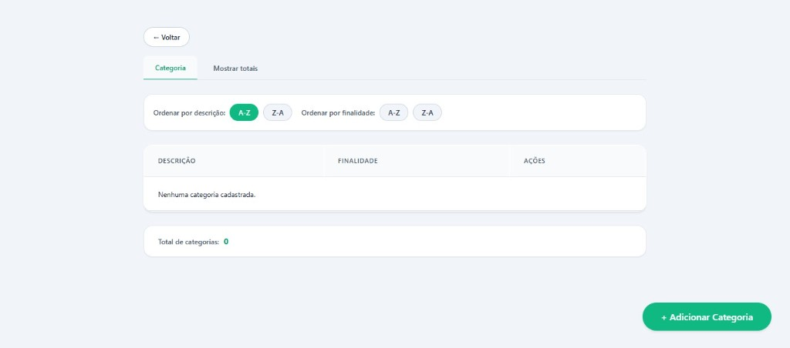
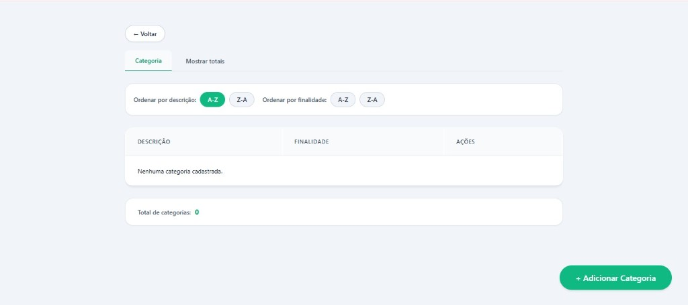

# Controle de Gastos Residenciais

Sistema para gerenciar os gastos de uma residencia. Permite cadastrar pessoas da familia, categorias de gastos e registrar transacoes de receitas e despesas, com consulta de totais por pessoa e por categoria.

## Tecnologias

- **Back-end:** C# com .NET 10 (Web API) e Entity Framework Core com SQLite
- **Front-end:** React 19 com TypeScript, Vite e Recharts para graficos

## Como rodar

### Pre-requisitos

- [.NET 10 SDK](https://dotnet.microsoft.com/download)
- [Node.js](https://nodejs.org/) (v18 ou superior)

### Instalacao

1. Clone o repositorio:

```bash
git clone https://github.com/GabrieleLopes0/residential-expense-control.git
cd residential-expense-control
```

2. Instale as dependencias do frontend:

```bash
cd expense-control-web
npm install
cd ..
```

3. Instale a dependencia da raiz (concurrently):

```bash
npm install
```

4. Crie o banco de dados:

```bash
cd ExpenseControl.API
dotnet ef database update
cd ..
```

### Rodando o projeto

Na pasta raiz do projeto, rode:

```bash
npm run start
```

Esse comando inicia o back-end e o front-end ao mesmo tempo. Depois e so abrir o navegador em:

- **Frontend:** http://localhost:5173
- **API (Swagger):** http://localhost:5285/swagger

### Executando com Docker

Caso prefira rodar usando Docker, o repositório agora inclui Dockerfiles para o backend e o frontend, além de um `docker-compose.yml` na raiz.

Na raiz do projeto, execute:

```bash
docker compose up --build
```

Depois acesse:

- **Frontend:** http://localhost:5173
- **API:** http://localhost:5285

> No modo Docker, o backend é exposto na porta 5285 e o frontend na porta 5173.

## Paginas

### Dashboard

Pagina inicial do sistema. Mostra um grafico com as receitas (verde) e despesas (vermelho) registradas, o saldo final e cards com a contagem de pessoas, transacoes e categorias cadastradas. Clicando nos cards voce navega para a pagina correspondente.



### Pessoas

Tela de cadastro da familia. Aqui voce adiciona, edita e remove as pessoas da residencia. Cada pessoa tem nome e idade. Ao deletar uma pessoa, todas as transacoes dela sao removidas junto.

Na aba "Mostrar totais" aparece uma tabela com o total de receitas, despesas e saldo de cada pessoa, com o total geral no final.



### Categorias

Tela de cadastro das categorias de gastos. Cada categoria tem uma descricao e uma finalidade que pode ser Receita, Despesa ou Ambas. Isso controla quais categorias aparecem na hora de criar uma transacao.

Na aba "Mostrar totais" aparece uma tabela com o total de receitas, despesas e saldo de cada categoria, com o total geral no final.



### Transacoes

Tela onde voce registra as movimentacoes financeiras. Cada transacao tem descricao, valor, tipo (receita ou despesa), uma pessoa responsavel e uma categoria.

Regras importantes:
- Menores de 18 anos so podem ter transacoes do tipo despesa
- A categoria e filtrada automaticamente conforme o tipo selecionado
- O valor precisa ser positivo e a descricao tem limite de 400 caracteres



## Estrutura do projeto

```
residential-expense-control/
  ExpenseControl.API/          -> Back-end (API .NET)
    Controllers/               -> Endpoints da API
    Entities/                  -> Modelos de dados
    Data/                      -> Contexto do banco
    Migrations/                -> Migracoes do banco
  expense-control-web/         -> Front-end (React)
    src/
      pages/                   -> Paginas da aplicacao
      components/              -> Componentes reutilizaveis
      services/                -> Configuracao da API
      types/                   -> Interfaces TypeScript
```
